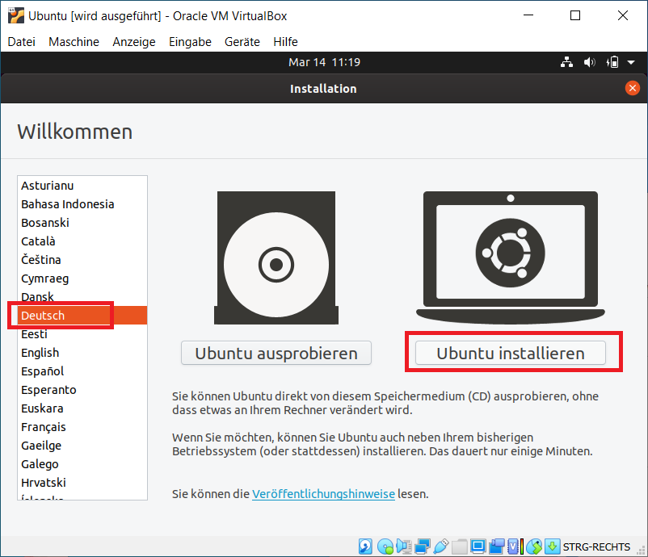
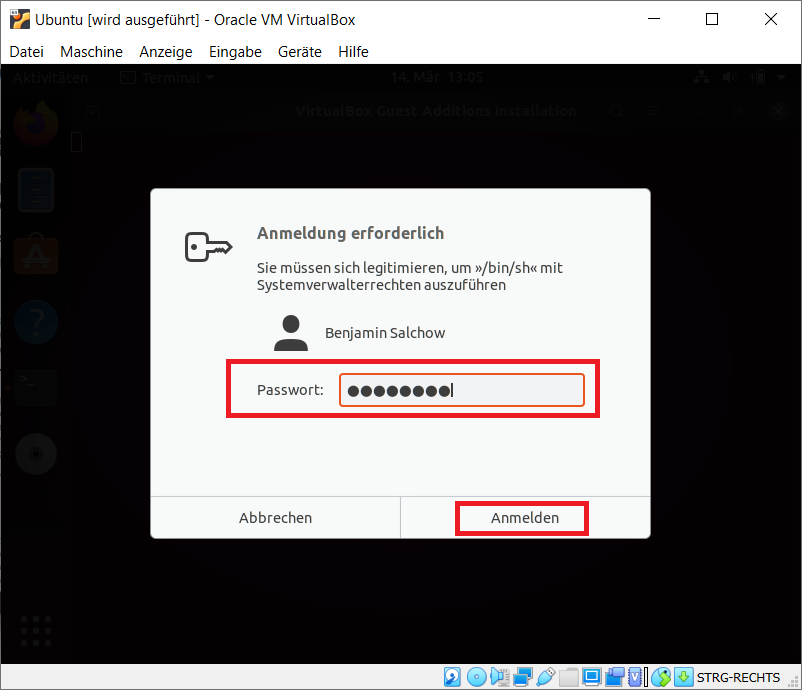

# Installation Virtual Box mit Ubuntu

## Grundlage

In diesem Schritt werden wir auf dem Computer eine virtuelle Maschine anlegen, welche für die Übungen und Projektarbeit der Vorlesung gedacht ist. Folgende Installation verwendet das Linux Derivat Ubuntu, welches für Einsteiger sehr geeignet ist. Natürlich können auch andere Linux Distributionen verwendet werden.

Eine Virtuelle Maschine (VM) ermöglicht das Ausführen eines weiteren Betriebssystems auf dem Computer. Veränderungen innerhalb der VM betreffen nicht das Host-System und bieten daher eine ideale Grundlage für Experimente.

Ein weiterer Grund ist, dass Container-Engines wie Docker am besten unter Linux laufen und daher auch unkomplizierter darauf zu verwenden sind. Da die Projektarbeit als Container abgegeben werden sollte, ist dies auch die perfekte Laufzeitumgebung hierfür.

## Vorbereitung

Folgende Pakete müssen heruntergeladen werden:
 * Virtual Box
   * https://www.virtualbox.org/wiki/Downloads
 * Ubuntu Desktop 19.10
   * https://ubuntu.com/download/desktop/thank-you/?version=19.10&architecture=amd64

Danach muss Virtual Box auf dem Computer installiert werden.

## Anlegen einer Ubuntu VM in Virtual Box

Erstellen einer neuen VM:

Grundlegende Informationen:

Festlegen der Arbeitsspeichergröße (ca. 1/4, aber mind. 2048 MB):

Anlegen einer dynamischen Festplatte:

Festlegen der Größe der Festplatte. Sollte mind. über 25 GB sein. Am besten 40 GB, wenn der Platz reicht. 

## Start der erstellten VM

Installationsmedium auswählen:

Das heruntergeladene Ubuntu Desktop Installationsimage auswählen:

Bestätigen und starten:

## Installation von Ubuntu in der Virtuellen Maschine

Die Sprache auswählen:

Sprache und Tastatur auswählen:

**Achtung:** Bei Virtual Box kann es sein, dass ein englisches Tastaturlayout verwendet wird! Daher bitte bei dem Testfeld unten prüfen. Alternativ kann nach der Installation mithilfe der "guest-tools" das Problem behoben werden. Konkret bedeutet das, dass jegliche Sonderzeichen nicht richtig sind und z = y ist.

Auswahl der minimalen Installation - benötigt deutlich weniger Platz und ist ausreichend.

Auswahl der Festplatte für die Installation:

Auswahl der Zeitzone:

Anlegen des Benutzers:

**Achtung:** Wie bereits oben erwähnt, könnte es Probleme mit dem Tastaturlayout geben! (z=y und vertauschte Sonderzeichen) Daher bitte ein einfaches Passwort vergeben. Dieses sollte unbedingt gemerkt und auf dem Host gespeichert werden! Die Verwendung von sicheren Password-Container wie KeePassX wird hier empfohlen.

Nun läuft die Installation und es wird etwas dauern, bis alles installiert ist.

Wenn die Installation fertig ist, fordert der Installationsmanager einen Neustart an. Nach dem Neustart müssen noch die Gasterweiterungen `guest-tools` installiert werden.

**Achtung:** Nach der Installation werden zuerst Updates installiert, dies kann eine Weile dauern. Folgende Schritte sollten erst gemacht werden, wenn die Ubuntu `Aktualisierungsverwaltung` fertig ist! Die Aktualisierung kann einen Neustart anfordern. Dieser sollte **unbedingt** durchgeführt werden, bevor die Gasterweiterungen `guest-tools` installiert werden.

Installation der Gasterweiterungen `guest-tools`:

Nach dem Einlegen der "Gasterweiterung" kann diese direkt ausgeführt werden.
**Hinweis:** Der Dialog kann unter Umständen erst nach 1-3 Minuten auftauchen. Wenn der Dialog nicht angezeigt wird, kann dieser über "Dateien" -> "CD-Laufwerk (VBox_GAs_x.x.x.x)" -> "autorun.sh" manuell gestartet werden.

Nach der Installation kann man den Terminal mit der "Enter"-Taste abschließen.

**Wichtig:** Danach muss die VM neu gestartet werden, damit die Gasterweiterung `guest-tools` ausgeführt wird.

Nach der Installation der Gasterweiterung `guest-tools` ist nun folgendes möglich:
 * Verwendung des richtigen Tastaturlayouts (de-DE)
 * Automatisches Skalieren der Anzeige
 * Gemeinsame Zwischenablage (copy and paste)
 * Integration von Ordnern
 * Weiterleitung von USB-Geräten

## Die Konsole

Die Konsole ist ein wichtiges Steuerelement für Linux-Betriebssysteme. Oft auch das einzige, wenn man mit Linux-Serversystemen arbeitet. Um einen schnellen Zugriff zur Konsole `Terminal` zu haben, kann man den `Terminal` zu den Favoriten hinzufügen.

**Hinweis:** Rechte Maustaste wird benötigt, um den Pop-Up-Dialog anzuzeigen!

Nach diesem Schritt kann nun in der Favoritenleiste (links) der `Terminal` direkt ausgewählt werden:

## Ausschalten der Virtuellen Maschine

Die VM kann wie folgt heruntergefahren werden:

Im folgenden Dialog kann dann auf `Ausschalten` geklickt werden.

## Optimierungen für bessere Performance

Sollte die Virtualisierung langsam sein, kann mit folgenden Schritten die Performance optimiert werden.

Wenn die VM ausgeschaltet ist, kann mit einem Klick auf Ändern in den VM-Einstellungen über "System" -> "Prozessor" folgendes angepasst werden:

**Hinweis:** Anzahl der Prozessor-Kerne, die für die VM verwendet werden sollten. Dabei sollte man jedoch nur reale Kerne verwenden (welche mit Grün unter dem Schieberegler angezeigt werden).

**Hinweis:** Erweiterung `Nested VT-x/AMD-V` beschleunigt Calls, die von den Containern verwendet werden. `PAE/NX aktivieren` sollte dabei auch aktiviert werden.

**Wichtig:** Manche Prozessoren unterstützen diese Techniken nicht, dadurch kann es sein, dass die VM nicht mehr hochfährt. Sollte dies der Fall sein, dann bitte wieder deaktivieren.

**Hinweis:** Eine weitere Beschleunigung kann noch erzielt werden, wenn als Paravirtualisierung: `Hyper-V` unter Windows 10 verwendet wird. Dies kann aber je nach Notebook auch zu Problemen führen.

**Hinweis:** Anzeigeeinstellungen können auch optimiert werden. Über "Anzeige" -> "Bildschirm" kann der Grafikkartenspeicher erhöht sowie die `3D-Beschleunigung` aktiviert werden. Sollte die VM danach nicht mehr starten, ist die Grafikkarte des Notebooks/PCs leider nicht ausreichend.

## Abschluss

Nun ist die VM installiert. Im nächsten Kapitel wird die benötigte Software installiert

[ - 2. Docker und Tools ->](../2-docker-und-tools/README.md)