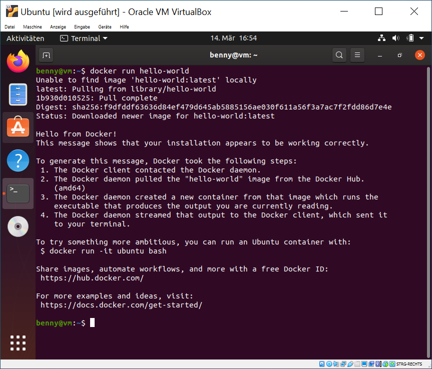

# Installation der Tools

Im Folgenden werden über den `Terminal` nun alle Softwarepakete installiert.

Hierzu wird folgendes in den `Terminal` eingegeben:

**Hinweis:** Alles mit `#` beginnend sind Kommentare!
Alles andere sollte Schritt für Schritt in den Terminal eingegeben werden.

**Wichtig:** Alle folgende Schritte benötigen Root-Rechte (Administrationsrechte). Daher muss initial folgendes einmalig im Terminal ausgeführt werden:

```sh
# Root-Rechte (Administrator-Rechte) bekommen:
sudo su
# Im Folgenden muss das Passwort eingegeben werden!
# Zeichen werden bei der Eingabe NICHT angezeigt!
```

Danach ändert sich die Eingabezeile von:
```sh
benny@vm:~$
```
zu:
```sh
root@vm:~#
```

## Vorbereiten für die Installation

Viele Linux-Distributionen haben eine Paketverwaltung, mit dessen Hilfe alle Pakete unter Linux installiert werden.
Damit die neuesten Versionen aller Pakete installiert werden, kann dies mit folgenden Befehlen vorbereitet werden:

```sh
# Leeren des Paketcaches
apt clean all

# Aktualisieren des Paketcaches
apt update
# Dies kann eine Weile dauern...

# Aktualisieren aller Pakete
apt dist-upgrade -y

# Aufräumen nicht benötigter Pakete
apt autoremove -y
```

## Installation

Im folgenden Kapitel werden alle Pakete installiert, die für die Projektarbeit benötigt werden.

Ubuntu benutzt hierfür zwei Installationsbefehle:
 * `apt` - Paketmanager, der Systemkomponente, Dienste und CLI-Programme isntalliert
 * `snap` - Alternativer Paketmanager (seit einigen Ubuntu-Versionen) hauptsächlich für grafische Anwendungen, die von Software-Herstellern bereitgestellt werden

**Hinweis:** Die Installation kann einige Zeit in Anspruch nehmen. Java und Eclipse sind optional und müssen nicht auf der VM installiert werden, wenn Java nicht verwendet wird. Eclipse und VScode können auch auf dem Host-System installiert werden.

```sh
# Installation aller notwendigen Pakete
apt install -y docker-compose nodejs git curl wget vim

# Installation von Java (optional)
apt install -y openjdk-11-jdk openjdk-11-jre mvn gradle
# Info: Java 13 wird von Spring Boot noch nicht voll unterstützt

# Installation von Eclipse (optional)
snap install --classic eclipse

# Installation von vscode
snap install --classic code
```

## Start des Container-Dienstes

In diesem Kapitel wird der Container-Dienst `Docker` gestarted und so konfiguriert, dass dieser Dienst in Zukunft automatisch mit dem System startet.

**Hinweis:** Folgende Schritte müssen nur einmalig durchgeführt werden. Nachdem der Dienst mittels `enable` registriert worden ist, wird dieser automatisch bei dem Systemstart gestartet.

```sh
# Start des Docker-Service
systemctl start docker

# Docker-Service automatisch mit dem Start des Betriebssystems starten
systemctl enable docker

# Docker-Service-Status prüfen
systemctl status docker
# Status sollte "active" und "running" sein
# Zum Beenden [STRG] + [C] drücken
```

## Zugriff als Nutzer zu Docker

Damit man ohne Root-Rechte das docker-CLI Tooling verwenden kann, muss man noch folgenden Befehl als Root ausführen:

**Wichtig:** Der Benutzername muss in dem Befehl noch eingesetzt werden, welcher bei der Installation verwendet wurde. Sollte man den Benutzernamen nicht wissen, kann dieser mittels: `cat /etc/passwd | grep 1000` ausgegeben werden. Benutzername ist der erste Text vor dem `:` (Doppelpunkt).

```sh
# Den normalen Benutzer zur Gruppe 'docker' hinzufügen
usermod -aG docker #BENUTZERNAME#
```

## Neustart

Nun sollte man die VM neu starten. Dies kann man auch mit folgendem Befehl im `Terminal` durchführen:

```sh
# Neustart-Befehl
reboot
```

## Funktionstest

Nach dem Neustart kann man nun testen, ob alles richtig installiert ist und funktioniert.

Folgende Zeile kann man nun als normaler Nutzer (**nicht als root**) ausführen:

```sh
docker run hello-world
```

Danach sollte die Ausgabe wie folgt aussehen:



Quelle: hello-world container - https://hub.docker.com/_/hello-world

## Material zum Verstehen von Docker

**Wichtig:** Folgende Links referenzieren **fremde Quellen**, die nicht von mir stammen. Inahlte können gelöscht oder geändert werden. Datum des Zugriffs (14.03.2020).

Offizielles Docker-Tutorial:
 * https://docs.docker.com/get-started/

Alternatives Tutorial zum Erstellen eigener Container:
 * https://docker-curriculum.com/#hello-world

Komplexeres Tutorial um Docker und Tooling:
 * https://jaxenter.de/einfuehrung-docker-tutorial-container-61528


## Docker Compose (das Starten von mehreren Containern)

Dieses Kapitel erklärt, wie man mehrere Container auf einmal startet mittels `docker-compose`.

 1. Erstelle einen neuen Ordner namens `wordpress` in Persönlicher Ordner
 2. Lege im Ordner eine Datei mit dem Namen `docker-compose.yml` an
 3. Füge folgenden Inhalt ein:
```sh
version: '3.1'

services:

  wordpress:
    image: wordpress
    restart: always
    ports:
      - 8080:80
    environment:
      WORDPRESS_DB_HOST: db
      WORDPRESS_DB_USER: exampleuser
      WORDPRESS_DB_PASSWORD: examplepass
      WORDPRESS_DB_NAME: exampledb
    volumes:
      - wordpress:/var/www/html

  db:
    image: mysql:5.7
    restart: always
    environment:
      MYSQL_DATABASE: exampledb
      MYSQL_USER: exampleuser
      MYSQL_PASSWORD: examplepass
      MYSQL_RANDOM_ROOT_PASSWORD: '1'
    volumes:
      - db:/var/lib/mysql

volumes:
  wordpress:
  db:
```

 4. Öffne einen `Terminal` 
 5. Gehe in das Verzeichnis:

```sh
# Ins Verzeichnis wechseln mittels 'cd'
cd wordpress
```

 6. Starte die Container mittels:

```sh
# docker-compose starten:
docker-compose up
```

 7. Starte den Firefox und gehe auf folgende Adresse URL: http://localhost:8080

Nun sollte der Firefox die Installation von Wordpress anzeigen.

Aktuell läuft ein Container, der ein Webserver ist, mit Wordpress und ein Container, der eine Datenbank beinhaltet (mysql), parallel.

Der Container kann mit [strg] + [c] beendet werden.

Mit dem Befehl `docker-compose down` werden die Container wieder entfernt.

**Hinweis:** docker-compose muss im Verzeichnis ausgeführt werden, wo sich die `docker-compose.yml` Datei befindet.

## Abschluss:

Nun ist Docker und die Umgebung installiert. Im nächsten Kapitel werden die Beispiele über `git` heruntergeladen und ausgeführt.

[ - 3. GIT und Beispielprojekte ->](../3-git-und-beispielprojekte/README.md)