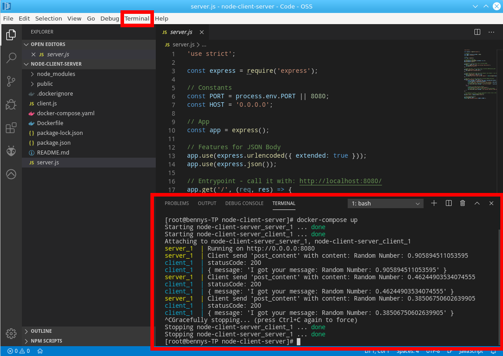

# Beispielprojekte

In diesem Kapitel wird erklärt, wie man GIT verwendet, um die Beispielprojekte herunterzuladen sowie die Verwendung dazu.

## GIT

GIT ist ein Versionierungsverwaltungstool, welches seit vielen Jahren professionell verwendet wird. Große bekannte Projekte, wie z.B. der Linux Kernel, verwenden GIT.

Auch diese Beschreibung ist öffentlich auf GitHub erreichbar und selbst in einem GIT-Repository. Der Vorteil ist, dass zu jeder Version gesprungen werden kann, dezentral weiterentwickelt werden kann und es ein flexibles Tool ist.

### Tutorials:

 * https://rogerdudler.github.io/git-guide/index.de.html
 * https://www.atlassian.com/de/git
 * https://guides.github.com/activities/hello-world/

### Auschecken der Projekte

Um die Beispielprojekte zu bekommen, muss das Repository auf den PC geklont werden.

Hierzu kann man direkt innerhalb der installierten VM folgenden Befehl ausführen:

**Hinweis:** Der folgende Befehl wird einen Ordner anlegen in dem Verzeichnis, wo `git clone` ausgeführt wird!

```sh
# auschecken der Beispiele mit GIT
git clone <TODO>
```

Nachdem dieser Befehl ausgeführt wurde, ist nun ein neuer Ordner im Dateisystem entstanden.

In diesem Verzeichnis sind alle Beispielprojekte enthalten mit dem dazugehörigen Quelltext. Diese können in ein eigenes Repository kopiert oder direkt im Verzeichnis verwendet werden.

## Erklärung der Projekte

Die Beispielprojekte sind in dem ausgecheckten Ordner: `TODO`.

Eine Auflistung aller Projekte und die dazugehörige Dokumentation kann man unter folgendem Link aufrufen:

`TODO LINK`

## Starten des Projekts

Innerhalb der VM kann jedes Projekt direkt gestartet werden. Hierzu empfiehlt sich der `docker-compose up` Befehl, welcher in den Projekten beschrieben wird.

## VS Code

Für die Entwicklung und Bearbeitung wird VS Code empfohlen. Innerhalb von VS Code kann direkt ein Terminal geöffnet werden, in dem das Projekt gestartet werden kann. Alternativ kann natürlich auch ein extra Terminal-Fenster geöffnet werden.



### Dokumentation

 * Webseite: https://code.visualstudio.com/
 * Dokumentation: https://code.visualstudio.com/docs